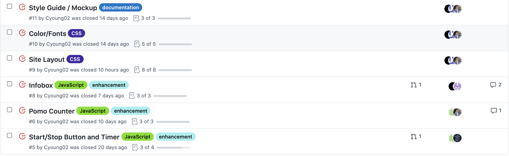

# Pomodore timer Second Sprint Review

## Time: Feb.21th - Ma.5th (2 Weeks)
## Members: team 23 - Whatever you want

## Tasks Accomplished
  - Info box merged to the master branch
  - Layout of the site change done
  - Setting done
  - Most of tasks list done

## Feburary 21th task Assign
-Benny will have JSDocs comments finished by tomorrow (friday) night, I will review and merge into master friday
-By our Sunday night meeting, please have:
  - Benny's changes rebased into your current branch and conflicts resolved
  - codestyle and linting correct
  - Unit tests done
  - JSDoc annotations done

## March 1st task Assign

- Nawwar- pull request for focus/relax and button layout changes by Monday 12:00 PM
- LA- pull request for info box by Wednesday at 12:00 PM
- Josh and Nawwar- pull request for finished settings menu before Thursday's meeting
- Benny, Zeven, and LA- pull request for initial task menu before Thursday's meeting
- PLEASE have unit tests and JSDoc annotations done, can't have Jordan flame us twice for the same thing

## March 5th task Assign
- Stella and Colin: Clean up random documents and ADRS
- Zeven and Edgar: Finish polished appearance for tasks menu
- Nawwar and LA: fixing weird layout inconsistencies
- Benny: clean up task menu code and push changes soon
- Edgar: fill out the info box
- josh: write unit tests, finish settings and pull request

### Attendance
- [x] Colin Young
- [x] Stella Ma
- [x] Josh Cross
- [x] Abdelkader Laouini (LA)
- [x] Benny Cai
- [x] Nawwar Tohme
- [x] Edgar Flores
- [x] Zeven Vidmar-Barker
