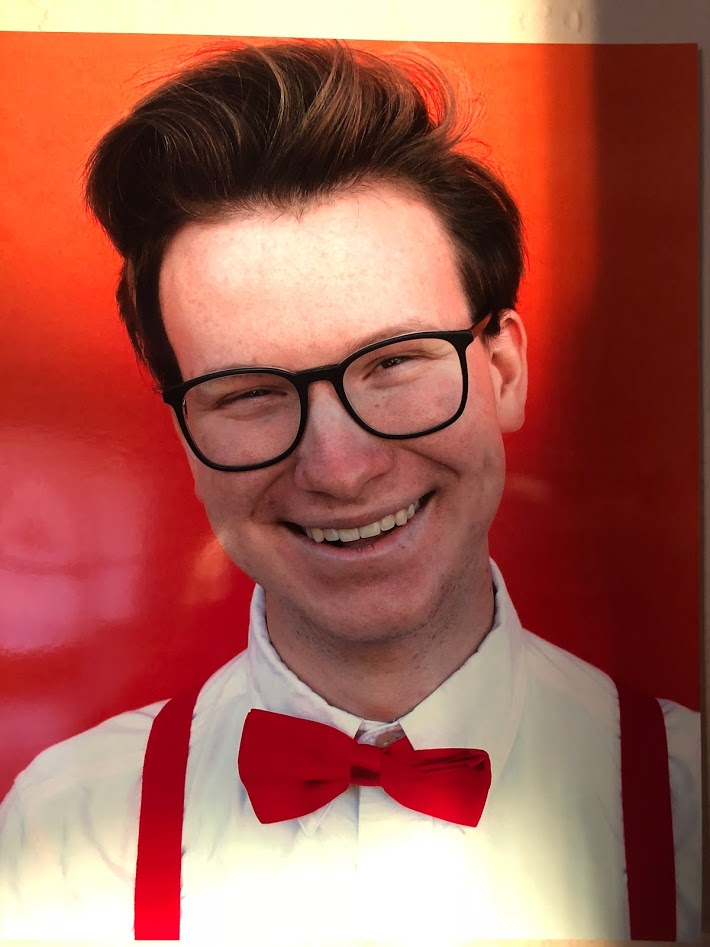
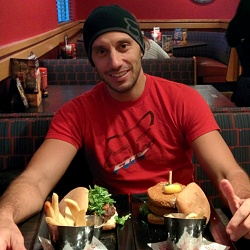
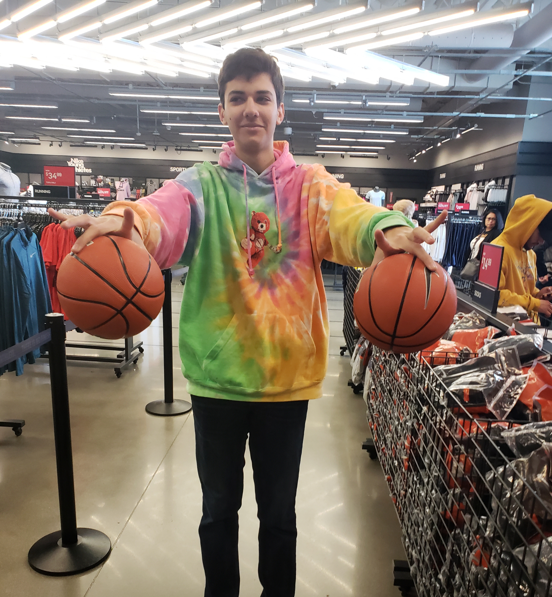
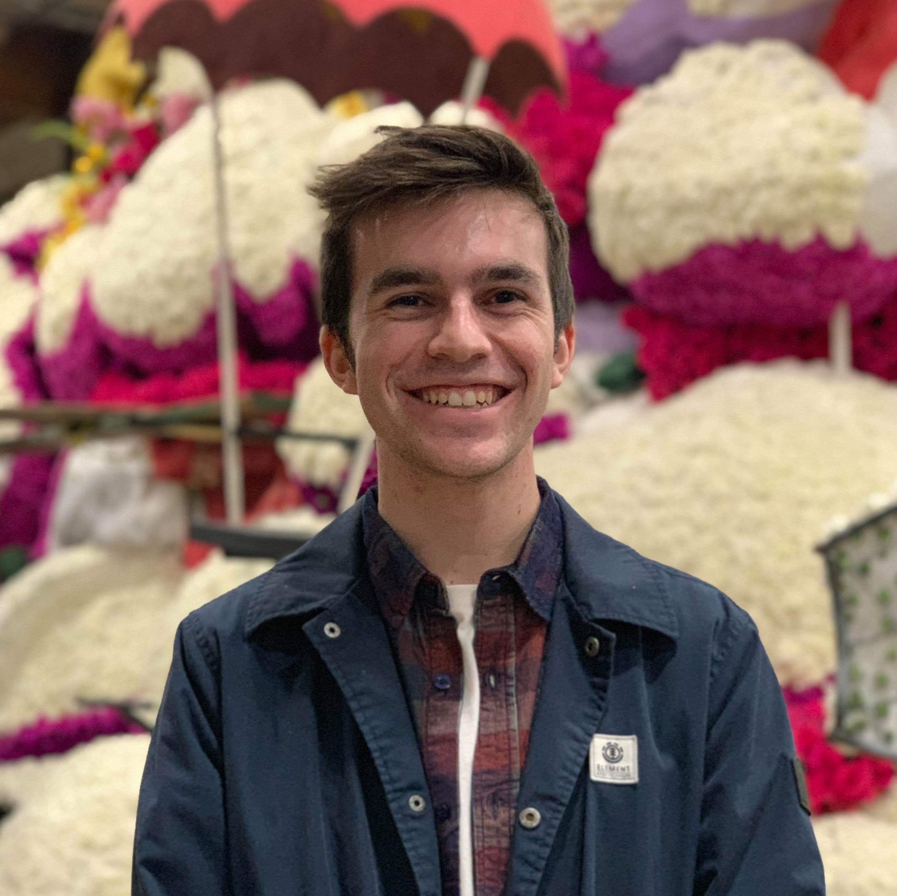

# Anything You Want ;)

We are "Anything You Want ;)" and we build exactly what it sounds like.
Our team development philosophy boils down to 4 words:

**Code Fast, Code Well.**

We don't just write code, we create experiences,. We push out iterative changes as fast as we can without sacrificing code maintainability. Scrappy coding causes teams to waste valuable time clearing up misconceptions and dealing with unweildy code; time which could have been spent making a better product for you. By writing scalable, clean, and iterative improvements to our codebase, we develop with the user as our first priority.

## Meet the Team:

### Colin Young

_Team Lead_

> Hi! I'm Colin and I'm a 2nd year Computer Science major in Marshall. When I'm not coding, you'll catch me practicing jazz saxophone, building mechanical keyboards, and playing video games. As far as my CS experience goes, I'm currently working on developing tools to help us track the spread of highly infectious diseases using molecular sequence data. Python is where it's at.

Click [here](https://cyoung02.github.io/) if you would like to know more about me.

### Stella Ma

_Team Lead_

> I'm Stella, a second year Computer Science major from Marshall college. I love finding new foods to try, going to new restaurants, and of course cooking.

You can find my full website [here](https://jmastella.github.io/)!

### Edgar Flores

_Software Engineer_

> My name is Edgar, and I'm a 4th year Computer Science major in Muir college. I love playing and composing music. I also enjoy cooking, filmography, and working out!

Click [here](https://eflores21.github.io/) for my full website!

### Benny Cai

_Software Engineer_

> My name is Benny, 19 years old, currently a second-year Cog-Sci major from Muir college. I am not married. I don't smoke or drink. I'm usually in bed by 1am and make sure I get eight hours of sleep, no matter what. I always have a piece of toast with jam for breakfast.

Here's [my website](https://damedollaforthree.github.io/)!

### Josh Cross

_Software Engineer_

> Hi! My name is Josh Cross, I'm a 2nd Year Computer Science major and I'm super excited to be on the team! I have a huge passion for programming, and I'm excited to see what we can do with the project. In my freetime, I really enjoy Video Games - both the creation/modding and playing of them, musical theater (the photo above was from a production of _James and the Giant Peach_), and playing with friends.

Check my website out [here](https://thecrossboy.github.io/cse110-pages/)!

### Abdelkader Laouini

_Software Engineer_

> _Abdelkader Laouini_, a.k.a **_L.A_**, future Electric and Computer Engineering at **UCSD**. I like challenges and solving problems even when I am not coding. I enjoy helping people. Adding value and making people's life easier is rewarding for me.

[Here's](https://github.com/laouinia/cse110lab01) the link to my website!

### Nawwar Tohme

_Software Engineer_

> My name is Nawwar, and I'm a third year Math-CS major. I enjoy learning things, basketball, and FPV drone flying. Also I can palm a basketball :).

You can find me at my [full website](https://tohmenawwar.github.io/) as well!

### Zeven Vidmar Barker

_Software Engineer_

> Hi, my name is Zeven and I'm a third year Math-Comp Sci major/ Cognitive Science minor from the Long Beach area. In my free time, I love finding new music to add to my Spotify playlists, playing games with friends, binging dramas, and challenging my taste buds with new and delicious foods 😳. Besides that, I am working on the front-end for a record-keeping web portal meant to bring accessibility and useful data to the service clubs of Circle K International.

You can find my full website [here](https://zvidmarb.github.io/)!
